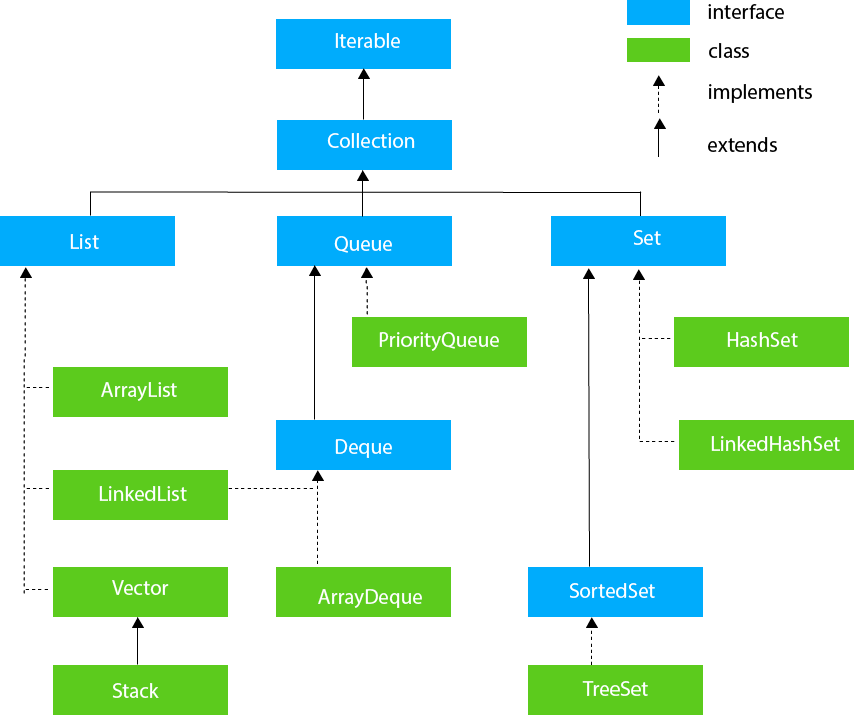
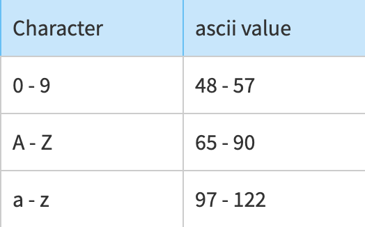

Collections Framework:


Since all the other classes implement Iterable and collection interfaces there are common methods which are listed below:
```java
//Methods in Iterable<T>
Iterator<T> iterator();
default void forEach(Consumer<? super T> action)
//Methods in Collections<E>
int size();
boolean isEmpty();
boolean contains(Object o);
Object[] toArray();
<T> T[] toArray(T[] a);
boolean add(E e);
boolean remove(Object o);
boolean containsAll(Collection<?> c);
boolean addAll(Collection<? extends E> c);
boolean removeAll(Collection<?> c);
default boolean removeIf(Predicate<? super E> filter)
void clear();
default Stream<E> stream();
default Stream<E> parallelStream();
```
### Iterator and Comparator:
```java
Iterator iterator = pq.iterator();
while (iterator.hasNext()) {
     doSomething(iterator.next());
 }
// comperator to sort by ascending order of name
class Sortbyname implements Comparator<Student> {
    public int compare(Student a, Student b)
    {
        return a.name.compareTo(b.name);
    }
} 
// same can be written leveraging functional interfaces and lambdas as
(a,b) -> a.name.compareTo(b.name)
// we can also use compareTo method inside comperator.
Integer x = new Integer(30);
Integer y = new Integer(30);
// as 30 equals 30, Output will be zero
System.out.println(x.compareTo(y));


```
### Stacks:
```java
Stack<Integer> stack = new Stack<>();
stack.push(2);
stack.peek(); // returns top element. NULL if stack is empty.
stack.pop(); // removes and returns top element.NoSuchElement if stack is empty.
```
### Queues:
```java
Queue<Integer> q = new LinkedList<>();
queue.add(1);
q.peek(); //peek the head of the queue, doesn't remove from queue.
q.poll(); // retrieves the head of the queue and removes it from queue.
// min heap
PriorityQueue<Integer> pQueue = new PriorityQueue<>(); 
//max heap
PriorityQueue<Integer> pQueue = new PriorityQueue<>(Collections.reverseOrder()); 
// queue with string reverse order
PriorityQueue<Integer> pq = new PriorityQueue<>((a,b)->b.name.compareTo(a.name));
```
### Deque:
```java
Deque<Integer> deque = new ArrayDeque<>();
deque.offerFirst(1);// better than addFirst cause it will throw exception if full
deque.offerLast(2);
deque.peeKFirst();
deque.peekLast();
int first = deque.pollFirst();
int last = deque.pollLast();
```
### Set:
```java
Set<Integer> a = new HashSet<Integer>(); 
Set<Integer> b = new HashSet<Integer>();
// To find union 
Set<Integer> union = new HashSet<Integer>(a); 
union.addAll(b);
// To find intersection 
Set<Integer> intersection = new HashSet<Integer>(a); 
intersection.retainAll(b); 
// To find the symmetric difference(excluding whatever is common)
Set<Integer> difference = new HashSet<Integer>(a); 
difference.removeAll(b);
```
### TreeSet:
```java
Set<Integer> treeSet = new HashSet<Integer>(); 
treeSet.ceiling(10); // returns a values just above 10 or NULL;
treeSet.floor(10); // returns a values just below 10 or NULL
treeset.first(); // returns first element
treeSet.last(); // returns last element
```
### Maps:
Use streams wherever you can.
```java
// get stream and use it for iterating over the entries
map.entrySet()
.stream()
.forEach(entry -> System.out.println(entry.getKey() + " - " + entry.getValue()));
//Filtering Data with filter
map.entrySet()
  .stream()
  .filter(entry -> entry.getValue() > 10)
  .forEach(entry -> System.out.println(entry.getKey() + " - " + entry.getValue()));
// Transforming Data with map
map.entrySet()
 .stream()
 .map(entry -> entry.getKey() + " - " + (entry.getValue() * 2))
 .forEach(System.out::println);
// Sorting Map directly with Comparators.
map.entrySet().stream()
.sorted(Map.Entry.comparingByKey())
.collect(Collectors.toList());
// Iterate over map easily with forEach.
map.forEach((k, v) -> System.out.println("Key: " + k + " Value: " + v));
//Get rid off ugly if-else condition, use getOrDefault method.
map.getOrDefault("B", "Nah!");
//Do not override keys accidentally use putIfAbsent
map.putIfAbsent("B", "x"); // if key "B" is present then nothing happens.
// if key present then value for key gets updated with function return vlaue.
map.comuteIfPresent(key, key -> {function});
// if key not present then <key, function return value> gets added to map.
map.computeIfAbsent(key, key -> {function});
// operate directly on values.
map.compute("B", (k, v) -> v.concat(" - new "));
//Replace and Remove utilities.
map.replaceAll((k, v) -> "x"); // values is "x" for all keys.
replace(K key, V oldValue, V newValue)
map.remove(key);
//To merge maps use merge method.
map.merge("B", "NEW", (v1, v2) -> v1 + v2);

// Iterate Map(using for each):

Map<String,String> map = new HashMap<String,String>();
map.forEach((k, v) -> System.out.println("Key: " + k + " Value: " + v));

// Iterate Map(using Iterator): Used when deletion of entries required

Iterator<Map.Entry<String, Integer>> itr = gfg.entrySet().iterator();
while(itr.hasNext()){
  Map.Entry<String, Integer> entry = itr.next();
  System.out.println("Key = " +entry.getKey() +", Value = " +entry.getValue());
}

// Iterating over keys using keySet():

for (String name : gfg.keySet())
    System.out.println("key: " + name);
// or using streams
gfg.keySet().stream().forEach(key-> System.out.println("key : "+key));

// Iterating over values using values():
for (String url : gfg.values())
    System.out.println("value: " + url);
// or using streams
gfg.values().stream().forEach(value -> System.out.println("value: " + url););

//Here first we loop over keys(using Map.keySet() method) and then search for value(using Map.get(key) method) for each key. 
//This method is not used in practice as it is pretty slow and inefficient as getting values by a key might be time-consuming.
//Iterating over keys and searching for values (inefficient), use forEach instead:
        
Map<String,String> gfg = new HashMap<String,String>();
// looping over keys
for (String name : gfg.keySet()){
// search  for value
    String url = gfg.get(name);
    System.out.println("Key = " + name + ", Value = " + url);
}
```

### Arrays:
use primitve arrays when you can as alternatives to pair etc. 
These are faster and memory efficient.\
```java
// Declaration
int[] arr1, arr2;
Student[] st1, st2; // array can be of User Ddefined Type

int[] arr1 = new int[5]; // Instantiation

int[] intArray = new int[]{ 1,2,3,4 }; // Form an array from literals

//Returning Arrays from Methods:
public static int[] m1() {
    return new int[]{1,2,3};
}
```
**Cloning of arrays:** A clone of 1D arrays is `deep-copy`.
```java
int[] cloneArray = intArray.clone();
//prints false as deep copy is created for cloneArray. references are different 
System.out.println(intArray == cloneArray);
```
A clone of a multi-dimensional array (like Object[][]) is a `shallow copy` however, which is to say that it creates only a single new array with each element array a reference to an original element array, but subarrays are shared.
```java
int[][] intArray = {{1,2,3},{4,5}};
int[][] cloneArray = intArray.clone();

System.out.println(intArray == cloneArray); // will print false

//print true as shallow copy is created i.e. sub-arrays are shared
System.out.println(intArray[0] == cloneArray[0]); 
System.out.println(intArray[1] == cloneArray[1]);
```
**The Arrays Class:**
The java.util.Arrays class contains various static methods for sorting and searching arrays, comparing arrays, and filling array elements.
These methods are overloaded for all primitive types.

```java
//returns index of the key in array. array needs to be sorted.
//Also, if element not found then it returns -(expected position). 
//Searching for 3 in [1,2] returns -2
//since index 2 is the right insertion point for 3.
int binarySearch(Object[] a, Object key) 
// true if the two specified arrays of longs are equal to one another. 
//Two arrays are considered equal 
//if both arrays contain the same number of elements, 
//and all corresponding pairs of elements in the two arrays are equal.
//Same method can be used by other primitive data types(byte,short,int,etc.)
boolean equals(long[] a, long[] a2)
 
//fills all elements. can be used by other primitive types.
//helpful in intializing array with a value.
void fill(int[] a, int val) 

void sort(Object[] a) 

// Returns a sequential Stream with the specified array as its source
static <T> Stream<T> stream(T[] array)
```
### Bit Manipulation:
**Operators:** or( | ), and (&), complement (~), xor(^),
signed right shift operator (>>), unsigned right shift operator (>>>),
left shift operator(<<), unsigned left shift operator (<<<)
- clear n LSBs: ~0 is sequence of 1's, so ~0 << n is 1's followed by n 0's. `AND`ing this with another value will clear the last n bits.
```java
// bitwise not of 5: ~5
// ~00000000 00000000 00000000 00000101=11111111 11111111 11111111 11111010
// will give 2's complement (32 bit) of 5 = -6
```
- **check if i'th bit is set:** num & (1<< i)!=0 
- **set i'th bit:** `num | (1<<i)`
- **clear i'th bit:** `num & ~(1<<i) `
- **clear all bits from MSB through i(inclusive):** mask = `(1<<i)-1`.\
  Ex: Let i=3, (1 << 3)-1 => 0111

### ascii value of character:
```java
String name = "admin";
char character = name.charAt(0); // This gives the character 'a'
//Though cast is not required explicitly, but its improves readability.
int ascii = (int) character;
```


**String handling**
String is immutable in java. So while solving any string problems look out for hidden memory allocation like substring creation which may not be apparent.

```java
// char to string
String str = String.valueOf(ch);

// charArray to string 
String str = new String(charArray); // be careful with new. Use it sparingly

// but above statement will create new object 
// so a better way would be to use valueOf()
String str = String.valueOf(charArray);

// String to charArray
char[] charArray = str.toCharArray();

// char at index 'i' in the String
char ch = str.charAt(i);
```
**String creation using StringBuilder:**
```java
StringBuilder sb = new StringBuilder();
sb.append(str);

//converts to String;
sb.toString(); 

// reverses the String;
sb.reverse(); 

// empty check condition;
(sb.Length==0) ;

// reset, there is no delete.
sb.setLength(0); 

// this also clears stringBuilder, and faster than setLength
sb.delete(0, state.sb.length());
```
**String creation using StringBuffer:**
`String builder is not synchronised hence not thread safe` so in a concurrent environment use string buffer instead.
String buffer extends Object class so it inherits some of the methods from the Object class which such as clone(), equals(), finalize(), getClass(), hashCode(), notifies(), notifyAll().

```java
StringBuffer sb = new StringBuffer("Hello ");
sb.append("world");// "Hello world"

//inserts this string at given position in original string.
sb.insert(1, "Java"); //output: "HJavaello world"

//replaces the given string from the specified beginIndex and endIndex-1
// so endIndex is exclusive
sb.replace(1, 5, "eee");// output: "Heeello world"

// deletes the string from the specified beginIndex to endIndex-1.
sb.delete(1, 4); // output: "Hello world"

//reverses the current string. 
sb.reverse(); //

// The capacity() method returns the current capacity of the buffer. 
// The default capacity of the buffer is 16. 
// If the number of characters increases from its current capacity, 
// it increases the capacity by (oldcapacity*2)+2.
//For instance, if your current capacity is 16, it will be (16*2)+2=34.
sb.capacity();
```
**Useful Methods in String class:**
```java
str.length();
str.isEmpty();
str.substring(startIndex,endIndex); // endIndex is exclusive
str.contains(charSequence);
str.equals(str2);
str.concat(str2);
```
**Split string:**
```java
Public String [ ] split ( String regex, int limit )

/* 
limit > 0 : pattern will be applied at most limit-1 times, the resulting
array's length will not be more than n, and
the resulting array's last entry will contain
all input beyond the last matched pattern.

limit < 0 : In this case, the pattern will be applied as
many times as possible, and the resulting
array can be of any size.

limit = 0 : In this case, the pattern will be applied as
many times as possible, the resulting array can
be of any size, and trailing empty strings will
be discarded. 
*/
```
### Sorting, Searching, Min,Max
**Sorting an array:**
To sort primitive array in desc order, we need to sort asc then reverse it in-place. No library methods can help!!
```java
method prototype: sort(T[] a, Comparator<? super T> c);

Arrays.sort(arr);

// For Arraylist:
Collections.sort(arrLsit); // ascending
Collections.sort(arrList, Collections.reverseOrder()); // descending

// There are two comperators
Comparator.naturalOrder();
Comparator.reverseOrder();
```
**Min/Max in Array/List:**
```java
int[] dp = new int[]{2,1,7,5,3};
// get max value
Arrays.stream(dp).max().orElse(0); 
// get min value
Arrays.stream(dp).min().orElse(0);
//Same for Collections
list.stream().min().orElse(0);
```
Other way would be to convert primitive array to list and use Collections.
```java
Collections.min(Arrays.asList(arr));
Collections.max(Arrays.asList(arr));
```
**Searching in array/list:**
```java
Use binary search:
1. Arrays.binarySearch(intArr,intKey);
2. Collections.binarySearch(List, intKey);
//If key is not present, the it returns "(-(insertion point) - 1)" 
// (returns a negative value).
```
References
[1] blog: https://cbarkinozer.medium.com/data-structures-and-algorithms-a-java-cheatsheet-de7250b90c45