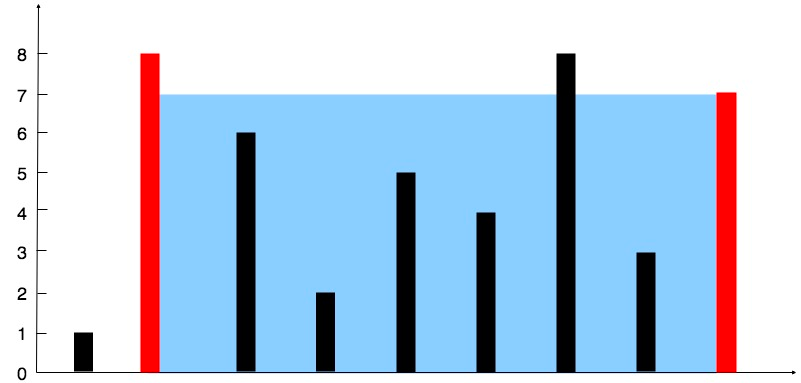

# [Container With Most Water](https://leetcode.com/problems/container-with-most-water/)

You are given an integer array height of length n. There are n vertical lines drawn such that the two endpoints of the ith line are (i, 0) and (i, height[i]).

Find two lines that together with the x-axis form a container, such that the container contains the most water.

Return the maximum amount of water a container can store.

Notice that you may not slant the container.

**Example 1:**



- Input: height = [1,8,6,2,5,4,8,3,7]
- Output: 49
- Explanation: The above vertical lines are represented by array [1,8,6,2,5,4,8,3,7]. In this case, the max area of water (blue section) the container can contain is 49.

**Example 2:**

- Input: height = [1,1]
- Output: 1

**Constraints:**

- n == height.length
- 2 <= n <= 105
- 0 <= height[i] <= 104

```agsl
// time: O(n)  space: O(1)
public int maxArea(int[] height) {
    int max_area=0,low=0,high=height.length-1;
    while(low<high){
        max_area = Math.max(max_area, (high-low)*Math.min(height[low],height[high]));
        if(height[low]<height[high]) ++low;
        else --high;
    }
    return max_area;
}
```
**Optimization**

While we are moving bars closer(left and right move closer) if next bar is equal or less than current then the area isn’t gonna be bigger(because bars are closer so they better be higher to have bigger area), 
so we can keep moving the left and right until a bigger value appears.

```agsl
// time: O(n)  space: O(1)
public int maxArea(int[] height) {
  int max_area=0,left=0,right=height.length-1;
  while(left<right){
      int minHeight = Math.min(height[left],height[right]);
      max_area = Math.max(max_area, (right-left)*minHeight);
//if next bar is equal or less than current then area isn't gonna be bigger. 
      while(height[left]<= minHeight && left<right) left++;
      while(height[right]<= minHeight && left<right) right--;
  }
  return max_area;
}
```
