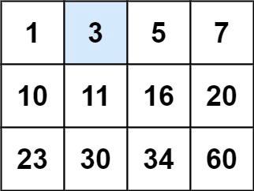

# [Search a 2D Matrix](https://leetcode.com/problems/search-a-2d-matrix/?envType=list&envId=rr2ss0g5)

You are given an `m x n` integer matrix `matrix` with the following two properties:

Each row is sorted in non-decreasing order.
The first integer of each row is greater than the last integer of the previous row.
Given an integer `target`, return `true` if target is in matrix or `false` otherwise.

You must write a solution in `O(log(m * n))` time complexity.

#### Example 1:


**Input:** matrix = [[1,3,5,7],[10,11,16,20],[23,30,34,60]], target = 3\
**Output:** true

# Solution

Approach 1: 
1. perform binary search on columns first. 
2. Once we pick the potential column that might contain the value.
3. Perform binary search on the row. 

```java
public boolean searchMatrix(int[][] matrix, int target) {
        if(matrix == null) return false;
        int row = matrix.length, col = matrix[0].length;
        ArrayList<Integer> arr = new ArrayList<>();
        
        //Use binary search on first column to find out the row that could possibly have the key.
        int low = 0,high = row-1,mid,index=0;
        while(low<=high){
            mid  = low +(high-low)/2;
            index = mid;
            if(matrix[mid][0] == target ) return true;
            else if(matrix[mid][0] < target && target <= matrix[mid][col-1]) break;
            else if(matrix[mid][0] < target && target > matrix[mid][col-1]) low= mid+1;
            else high = mid-1;
        }
        // binary search on row.
        low = 0;
        high = col-1;
        while(low<=high){
            mid  = low +(high-low)/2; 
            if(matrix[index][mid] == target) return true;
            else if(matrix[index][mid] > target) high  = mid-1;
            else    low = mid+1;
        }  
        
        return (matrix[index][0]==target);
    }
```

Approach 2:

Don't treat it as a 2D matrix, just treat it as a sorted list.

```java
public boolean searchMatrix(int[][] matrix, int target) {
    int m = matrix.length;
    int n = matrix[0].length;
    int left = 0, right = m * n - 1;

    while (left <= right) {
        int mid = left + (right - left) / 2;
        int mid_val = matrix[mid / n][mid % n];

        if (mid_val == target)
            return true;
        else if (mid_val < target)
            left = mid + 1;
        else
            right = mid - 1;
    }
    return false;
}
```

