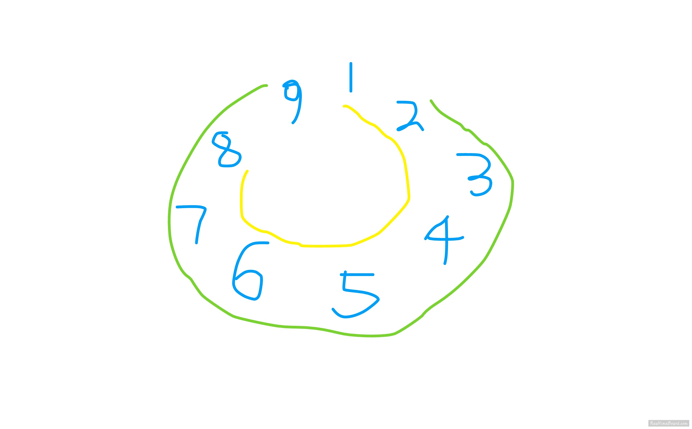

# [House Robber II](https://leetcode.com/problems/house-robber-ii/)

You are a professional robber planning to rob houses along a street. 
Each house has a certain amount of money stashed. 
**All houses at this place are arranged in a circle**. 
That means the first house is the neighbor of the last one. 
Meanwhile, adjacent houses have a security system connected, 
and it will automatically contact the police if two adjacent houses were broken into on the same night.

Given an integer array `nums` representing the amount of money of each house, 
return the maximum amount of money you can rob tonight without alerting the police.

**Example 1:**

- Input: nums = [2,3,2]
- Output: 3

Explanation: You cannot rob house 1 (money = 2) and then rob house 3 (money = 2), because they are adjacent houses.

**Example 2:**

- Input: nums = [1,2,3,1]
- Output: 4

Explanation: Rob house 1 (money = 1) and then rob house 3 (money = 3).
Total amount you can rob = 1 + 3 = 4.

**Example 3:**

- Input: nums = [1,2,3]
- Output: 3


**Constraints:**

- 1 <= nums.length <= 100
- 0 <= nums[i] <= 1000

# Solutions

**Approach1:** 

```java
class Solution {
    public int rob(int[] nums) {
        int size = nums.length;
        if(size == 1) return nums[0];
        else if(size == 2) return Math.max(nums[0], nums[1]);
        else if( size == 3) return Math.max(nums[2], Math.max(nums[0], nums[1]));
        else{
            // with first house selected, we can't select the last house. 
            // so it will be rob(0, n-1)
            int withFirst = rob(nums, 0, nums.length-2);

            // If the first house not selected, then we can select the last house
            // so it will be rob(1,n); 
            int withoutFirst = rob(nums, 1, nums.length-1);

            // max of above 2 is the answer
            return Math.max(withFirst, withoutFirst);

        } 
    }

    private int rob(int[] nums, int start, int end) {
        int maxTillPrevPrev = 0, maxTillPrev = 0, maxTillHere = 0;
        for(int i=start;i<=end;i++){
            maxTillHere = Math.max(nums[i]+maxTillPrevPrev, maxTillPrev);
            maxTillPrevPrev = maxTillPrev;
            maxTillPrev = maxTillHere;
        }
        return maxTillHere;
    }
}
```

**Approach2:**
Since this question is a follow-up to House Robber, we can assume we already have a way to solve the simpler question, 
i.e. given a 1 row of house, we know how to rob them.
So we already have such a helper function. We modify it a bit to rob a given range of houses.

```java
private int rob(int[] num, int lo, int hi) {
    int include = 0, exclude = 0;
    for (int j = lo; j <= hi; j++) {
        int i = include, e = exclude;
        include = e + num[j];
        exclude = Math.max(e, i);
    }
    return Math.max(include, exclude);
}
```
Now the question is how to rob a circular row of houses. It is a bit complicated to solve like the simpler question. 
It is because in the simpler question whether to rob num[lo] is entirely our choice. But, it is now constrained by whether num[hi] is robbed.

However, since we already have a nice solution to the simpler problem. 
We do not want to throw it away. Then, it becomes how can we reduce this problem to the simpler one. 
Actually, extending from the logic that if house i is not robbed, then you are free to choose whether to rob house i + 1, you can break the circle by assuming a house is not robbed.

For example, 1 -> 2 -> 3 -> 1 becomes 2 -> 3 if 1 is not robbed.

Since every house is either robbed or not robbed and at least half of the houses are not robbed, the solution is simply the larger of two cases with consecutive houses, 
i.e. house i not robbed, break the circle, solve it, or house i + 1 not robbed. Hence, the following solution. I chose i = n and i + 1 = 0 for simpler coding. 
But, you can choose whichever two consecutive ones.
```java
public int rob(int[] nums) {
    if (nums.length == 1) return nums[0];
    return Math.max(rob(nums, 0, nums.length - 2), rob(nums, 1, nums.length - 1));
}
```

**Approach3:**
We can divide this problem to two sub problems:
Let's take following example:
- Subproblem 1: rob house 1 ~ 8
- Subproblem 2: rob house 2 ~ 9

And find the bigger one of these two sub problems.



```java
    public int rob(int[] nums) {
      if (nums.length == 1) return nums[0];  
      return Math.max(rob0(nums), rob1(nums));
    }
    
    public int rob0(int[] nums){
      int preMax = 0, curMax = 0;
      for(int i = 0; i < nums.length - 1; i++){
        int t = curMax;
        curMax = Math.max(preMax + nums[i], curMax);
        preMax = t;  
      }  
      return curMax;
    }
    
    public int rob1(int[] nums){
      int preMax = 0, curMax = 0;
      for(int i = 1; i < nums.length; i++){
        int t = curMax;
        curMax = Math.max(preMax + nums[i], curMax);
        preMax = t;  
      }  
      return curMax;  
    }
```