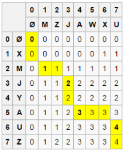

# [Longest Common Subsequence](https://leetcode.com/problems/longest-common-subsequence/)

Given two strings `text1` and `text2`, return the length of their longest common subsequence. If there is no common subsequence, return `0`.

A **subsequence** of a string is a new string generated from the original string with some characters (can be none) deleted without changing the relative order of the remaining characters.

For example, `ace` is a subsequence of `abcde`.
A **common subsequence** of two strings is a subsequence that is common to both strings.

**Example 1:**

- Input: text1 = "abcde", text2 = "ace"
- Output: 3  

Explanation: The longest common subsequence is "ace" and its length is 3.

**Example 2:**

- Input: text1 = "abc", text2 = "abc"
- Output: 3

Explanation: The longest common subsequence is "abc" and its length is 3.

**Example 3:**
- Input: text1 = "abc", text2 = "def"
- Output: 0

Explanation: There is no such common subsequence, so the result is 0.


**Constraints:**

- 1 <= text1.length, text2.length <= 1000
- `text1` and `text2` consist of only lowercase English characters.

# Solutions

**Time & space complexity:** `O(m * n)`

Find LCS;
Let `X` be `"XMJYAUZ"` and `Y`be `"MZJAWXU"`. 
The longest common subsequence between `X` and `Y` is `“MJAU”`. 
The following table shows the lengths of the longest common subsequences between prefixes of `X` and `Y`. 
The i<sup>th</sup> row and j<sup>th</sup> column shows the length of the LCS between X_{1..i} and Y_{1..j}.



```java
class Solution {
    public int longestCommonSubsequence(String text1, String text2) {
        int length1= text1.length(), length2 = text2.length();
        int dp[][]=new int [length1+1][length2+1];

        for(int i=0;i<=length1;i++){
            for(int j=0;j<=length2;j++){
                if(i==0||j==0) dp[i][j]=0;
                else if(text1.charAt(i-1) == text2.charAt(j-1)) dp[i][j] = 1+dp[i-1][j-1];
                else{
                    dp[i][j] = Math.max(dp[i-1][j], dp[i][j-1]);
                }
            }
        }
        return dp[length1][length2];
    }
}
```


