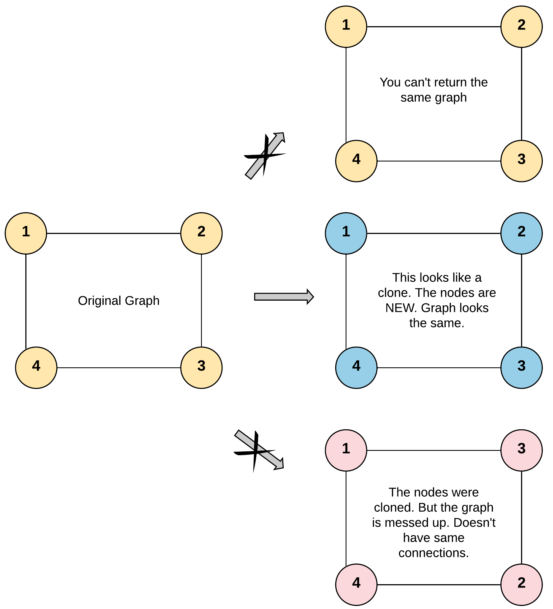
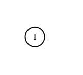

# [Clone Graph](https://leetcode.com/problems/clone-graph/description/)

Given a reference of a node in a **connected** undirected graphs, return a **deep copy (clone)** of the graphs.

Each node in the graphs contains a value (int) and a list (List[Node]) of its neighbors.

```
class Node {
    public int val;
    public List<Node> neighbors;
}
```


 ### Test case format:

For simplicity, each node's value is the same as the node's index (1-indexed). 
For example, the first node with `val == 1`, the second node with `val == 2`, and so on. The graphs is represented in the test case using an adjacency list.

**An adjacency list** is a collection of unordered **lists** used to represent a finite graphs. 
Each list describes the set of neighbors of a node in the graphs.

The given node will always be the first node with `val = 1`. 
You must return the **copy of the given node** as a reference to the cloned graphs.

 **Example 1:**
 


**Input:** adjList = [[2,4],[1,3],[2,4],[1,3]]

**Output:** [[2,4],[1,3],[2,4],[1,3]]

**Explanation:** There are 4 nodes in the graphs.

* 1st node (val = 1)'s neighbors are 2nd node (val = 2) and 4th node (val = 4).
* 2nd node (val = 2)'s neighbors are 1st node (val = 1) and 3rd node (val = 3).
* 3rd node (val = 3)'s neighbors are 2nd node (val = 2) and 4th node (val = 4).
* 4th node (val = 4)'s neighbors are 1st node (val = 1) and 3rd node (val = 3).

**Example 2:**



**Input:** adjList = [[]]

**Output:** [[]]

**Explanation:** Note that the input contains one empty list. The graphs consists of only one node with val = 1 and it does not have any neighbors.

**Example 3:**

**Input:** adjList = []

**Output:** []

**Explanation:** This an empty graphs, it does not have any nodes.


### Constraints:

* The number of nodes in the graphs is in the range `[0, 100]`.
* `1 <= Node.val <= 100`
* `Node.val` is unique for each node.
* There are no repeated edges and no self-loops in the graphs.
* The Graph is connected and all nodes can be visited starting from the given node.

## Solutions

```java
public Node cloneGraph(Node node) {
    if(node == null) return node;
    Node[] map = new Node[101]; //max nodes can 100 as mentioned in the problem
    cloneGraph(node, map);
    return map[node.val];
}

public void cloneGraph(Node node, Node[] map){

    if(map[node.val]!= null) return;
    map[node.val] = new Node(node.val);
    
    for(Node neighbor: node.neighbors){
        cloneGraph(neighbor, map);
        map[node.val].neighbors.add(map[neighbor.val]);
    }
}
```
### Better approach:

```java
class Solution {
    
    Map<Node, Node> map = new HashMap <>(); 
    
    public Node cloneGraph(Node node) {
        
        if(node == null) return node; 
        
        if(map.containsKey(node)){
            return map.get(node); // return cloned 
        }
        
        Node clone = new Node(node.val, new ArrayList()); 
        map.put(node, clone); 
        
        for(Node neighbor: node.neighbors){
            clone.neighbors.add(cloneGraph(neighbor)); 
        }
        return clone; 
    }
}
```