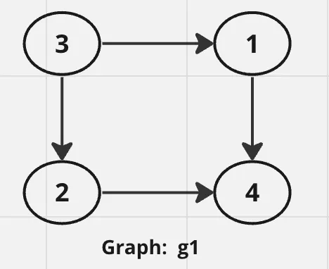

# [Course Schedule](https://leetcode.com/problems/course-schedule/description/)

There are a total of `numCourses` courses you have to take, labeled from `0` to `numCourses - 1`. 
You are given an array `prerequisites` where **prerequisites[i] = [a<sub>i</sub>, b<sub>i</sub>]** indicates that you must take course **b<sub>i</sub>** first if you want to take course **a<sub>i</sub>**.

For example, the pair `[0, 1]`, indicates that to take course `0` you have to first take course `1`.
Return `true` if you can finish all courses. Otherwise, return `false`.

#### Example 1:

**Input:** numCourses = 2, prerequisites = [[1,0]]\
**Output:** true\
**Explanation:** There are a total of 2 courses to take.
To take course 1 you should have finished course 0. So it is possible.

#### Example 2:

**Input:** numCourses = 2, prerequisites = [[1,0],[0,1]]\
**Output:** false\
**Explanation:** There are a total of 2 courses to take.
To take course 1 you should have finished course 0, and to take course 0 you should also have finished course 1. 
So it is impossible.


### Constraints:

* 1 <= numCourses <= 2000
* 0 <= prerequisites.length <= 5000
* prerequisites[i].length == 2
* 0 <= a<sub>i</sub>, b<sub>i</sub> < numCourses
* All the pairs prerequisites[i] are **unique**.

## Solutions

Only catch here is since it is directed graph a node can be reached twice but still doesn’t mean there is a cycle. 
In below graph, `4` is visited again while processing `3` but that doesn’t mean there’s a cycle. 
For that reason, once a node is processed, we are removing it from hashmap.



```java
public boolean canFinish(int numCourses, int[][] prerequisites) {
    if(prerequisites.length<=1) return true;

    ArrayList<ArrayList<Integer>> graph = new ArrayList<>();

    for(int i=0;i<numCourses;i++){
        graph.add(new ArrayList<Integer>());
    }

    // construct graph as adjacency list
    for(int[] edge: prerequisites){
        graph.get(edge[0]).add(edge[1]);
    }

    for(int i=0;i<numCourses;i++){
        if(graph.get(i).size()>0){
    // this map keeps track of all the nodes visited starting from node i
    // if current node is already in the map then there's a cycle.
            HashMap<Integer, Boolean> processedCourses = new HashMap<>();
            boolean val = isPossible(i, graph, processedCourses);
            if(val==false) return val;
        }
    }
    return true;
}

private boolean isPossible(int course, ArrayList<ArrayList<Integer>> graph, HashMap<Integer, Boolean> processedCourses){
    if(processedCourses.containsKey(course)) return false;
    
    processedCourses.put(course, true);

    for(int i : graph.get(course)){
        boolean val = isPossible(i, graph, processedCourses);
        if(val==false) return val;
    }
    
    processedCourses.remove(course);
    return true;
}
```

### Better approach: 

```java
class Solution {
    public boolean canFinish(int n, int[][] ps) {
        boolean[] v = new boolean[ps.length];
        int[] dc = new int[n];
        for(int[] p: ps){
            dc[p[1]]++;
        }
        
        boolean f = true;
        while (f){
            f = false;
            for(int i = 0; i < ps.length; i++){
                if(!v[i] && dc[ps[i][0]] == 0){
                    v[i] = f = true;
                    dc[ps[i][1]]--;
                }
            }
        }
        for(int i : dc){
            if(i != 0) return false;
        }
        return true;
    }
}
```
