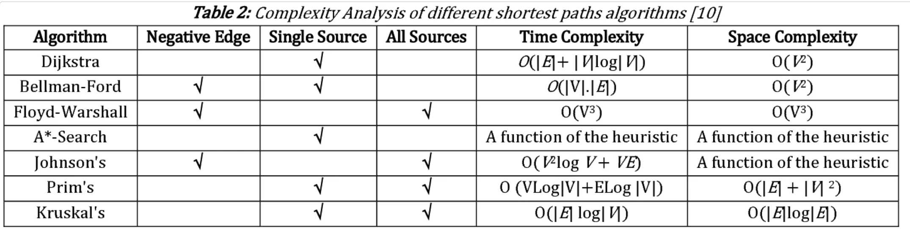

Graphs an be represented in two ways, `Adjacency list` and `Adjacency matrix`. 
For sparse graphs `adjacency list` is usually better, for dense graphs `adj matrix` is good. 
Only disadvantage of lists is when checking if there is an edge(directed or undirected) connecting (u,v).

# Algorithms:



## BFS:
```java
void bfs(int startNode){
    // Create a queue for BFS
    Queue<Integer> queue = new LinkedList<>();
    boolean[] visited = new boolean[vertices];

    // Mark the current node as visited and enqueue it
    visited[startNode] = true;
    queue.add(startNode);

    // Iterate over the queue
    while (!queue.isEmpty()) {
        // Dequeue a vertex from queue and print it
        int currentNode = queue.poll();
        System.out.print(currentNode + " ");

        // Get all adjacent vertices of the dequeued
        // vertex currentNode If an adjacent has not
        // been visited, then mark it visited and
        // enqueue it
        for (int neighbor : adjList[currentNode]) {
            if (!visited[neighbor]) {
                visited[neighbor] = true;
                queue.add(neighbor);
            }
        }
    }
}
```

## DFS:

```java
void DFSUtil(int v, boolean visited[]){
        // Mark the current node as visited and print it
        visited[v] = true;
        // process the current node
        processNode(v);
 
        // Recur for all the vertices adjacent to this vertex
        Iterator<Integer> i = adj[v].listIterator();
        while (i.hasNext()) {
            int n = i.next();
            if (!visited[n])
                DFSUtil(n, visited);
        }
}
```
## Topological Sorting:

Topological sorting for `Directed Acyclic Graph (DAG)` is a linear ordering of vertices such that for every directed edge u-v, vertex u comes before v in the ordering.

**Note:** Topological sorting doesn't work if the given graph has cycle(s).

**Algorithm:**
- Initialize a stack and a visited array of size n.
- For each unvisited vertex in the graph, do the following:
- Call the DFS function with the vertex as the parameter.
- In the DFS function, mark the vertex as visited and recursively call the DFS function for all unvisited neighbors of the vertex.
- Once all the neighbors have been visited, push the vertex onto the stack.
- After all, vertices have been visited, pop elements from the stack and append them to the output list until the stack is empty.

```java
// Function to perform Topological Sort
static void topologicalSort(List<List<Integer> > adj, int V){
        // Stack to store the result
        Stack<Integer> stack = new Stack<>();
        boolean[] visited = new boolean[V];

        // Call the recursive helper function to store
        // Topological Sort starting from all vertices one by one
        for (int i = 0; i < V; i++) {
            if (!visited[i])
                topologicalSortUtil(i, adj, visited, stack);
        }

        // Print contents of stack
        System.out.print(
            "Topological sorting of the graph: ");
        while (!stack.empty()) {
            System.out.print(stack.pop() + " ");
        }
}

// Function to perform DFS and topological sorting
static void topologicalSortUtil(int v, List<List<Integer> > adj, boolean[] visited,
        Stack<Integer> stack) {
        // Mark the current node as visited
        visited[v] = true;

        // Recur for all adjacent vertices
        for (int i : adj.get(v)) {
        if (!visited[i])
            topologicalSortUtil(i, adj, visited, stack);
        }

        // Push current vertex to stack which stores the result
        stack.push(v);
}
```
## Minimal Spanning Tree: 

Connecting the graph with edges with minimum weights as much as possible.

**Kruskal’s :**

- Keep vertices in a set.
- Sort edges by weight.
- Keep adding edges one by one starting with smallest weight one. 
- While adding check if this new edge is forming a cycle using `union-find`.
- If Not then add edge to graph, remove the vertex from the set.
- else move on to the next edge.
- continue till set is empty(meaning all vertices are added to spanning tree).

```java
public class KruskalsEdgeList {

  // Union find data structure
  static class UnionFind {

    private int[] id, sz;

    public UnionFind(int n) {
      id = new int[n];
      sz = new int[n];
      for (int i = 0; i < n; i++) {
        id[i] = i;
        sz[i] = 1;
      }
    }

    public int find(int p) {
      int root = p;
      while (root != id[root]) root = id[root];
      while (p != root) { // Do path compression
        int next = id[p];
        id[p] = root;
        p = next;
      }
      return root;
    }

    public boolean connected(int p, int q) {
      return find(p) == find(q);
    }

    public int size(int p) {
      return sz[find(p)];
    }

    public void union(int p, int q) {
      int root1 = find(p);
      int root2 = find(q);
      if (root1 == root2) return;
      if (sz[root1] < sz[root2]) {
        sz[root2] += sz[root1];
        id[root1] = root2;
      } else {
        sz[root1] += sz[root2];
        id[root2] = root1;
      }
    }
  }

  static class Edge implements Comparable<Edge> {
    int from, to, cost;

    public Edge(int from, int to, int cost) {
      this.from = from;
      this.to = to;
      this.cost = cost;
    }

    @Override
    public int compareTo(Edge other) {
      return cost - other.cost;
    }
  }

  // Given a graph represented as an edge list this method finds the Minimum Spanning Tree (MST) cost if there exists
  // a MST, otherwise it returns null.
  static Long kruskals(Edge[] edges, int n) {

    if (edges == null) return null;

    long sum = 0L;
    java.util.Arrays.sort(edges);
    UnionFind uf = new UnionFind(n);

    for (Edge edge : edges) {
      // Skip this edge to avoid creating a cycle in MST
      if (uf.connected(edge.from, edge.to)) continue;

      // Include this edge
      uf.union(edge.from, edge.to);
      sum += edge.cost;
      // Optimization to stop early if we found a MST that includes all the nodes
      if (uf.size(0) == n) break;
    }
    // Make sure we have a MST that includes all the nodes
    if (uf.size(0) != n) return null;
    return sum;
  }
}
```

**Prim's:**

- Start with a node, pick the edge with minimum weight.
- For example, starting at vertex a, after picking minimum edge we have a and b connected by the minimum edge.
- Now for this to be connected with the rest of the graph, it can be through a or b. So we have to pick minimum edge available at either a or b. Then a and b will be connected with rest of the graph.
- Let’s assume that new vertex is c. Then for next step, we have to pick minimum of edges at a, b and c. so that this sub graph containing (a,b,c) will be connected with rest of the graph.
- Repeat until all vertices are connected.

```java
// Function of spanning tree
static int spanningTree(int V, int E, int edges[][]) {
        ArrayList<ArrayList<Pair>> adj=new ArrayList<>();
        for(int i=0;i<V;i++){
            adj.add(new ArrayList<Pair>());
        }
        // form adjacency matrix
        for(int i=0;i<edges.length;i++)
        {
            int u=edges[i][0];
            int v=edges[i][1];
            int wt=edges[i][2];
            adj.get(u).add(new Pair(v,wt));
            adj.get(v).add(new Pair(u,wt));
        }
        
        PriorityQueue<Pair> pq = new PriorityQueue<Pair>();
        pq.add(new Pair(0,0));
        int[] vis=new int[V];
        int s=0;
        
        while(!pq.isEmpty())
        {
            Pair node=pq.poll();
            int v=node.v;
            int wt=node.wt;
            if(vis[v]==1) continue;

            s+=wt;
            vis[v]=1;
            for(Pair it:adj.get(v)){
                if(vis[it.v]==0)
                {
                    pq.add(new Pair(it.v,it.wt));
                }
            }
        }
        return s;
}
```
# Shortest path algorithms:

## Single source shortest path algorithms: 

Starting from source vertex, we calculate the distance of all other vertices from source.

**Dijikstra :** 

It only works if there`no negative cycles`.


**Bellmann-ford:** 

Works even if graph has negative cycles.

# All pairs shortest path algorithms:
**Floyd-warshall:** 

It is dp based algorithm. 
For node `d`, assuming there are two adjacent nodes `a`, `b` then

`distance[d] = min(distance[a]+weight[a,d], distance[b]+weight[b,d]);`
 

