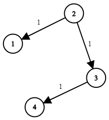

# Network Delay Time

You are given a network of `n` nodes, labeled from `1` to `n`. 
You are also given times, a list of travel times as directed edges **times[i] = (u<sub>i</sub>, v<sub>i</sub>, w<sub>i</sub>)**, where **u<sub>i</sub>** is the source node, **v<sub>i</sub>** is the target node, and **w<sub>i</sub>** is the time it takes for a signal to travel from `source` to `target`.

We will send a signal from a given node `k`. 
Return _the minimum time_ it takes for all the `n` nodes to receive the signal. 
If it is impossible for all the `n` nodes to receive the signal, return `-1`.

**Example 1:**



**Input:** times = [[2,1,1],[2,3,1],[3,4,1]], n = 4, k = 2\
**Output:** 2

**Example 2:**

**Input:** times = [[1,2,1]], n = 2, k = 1\
**Output:** 1

**Example 3:**

**Input:** times = [[1,2,1]], n = 2, k = 2\
**Output:** -1


**Constraints:**

* 1 <= k <= n <= 100
* 1 <= times.length <= 6000
* times[i].length == 3
* 1 <= u<sub>i</sub>, v<sub>i</sub><= n
* u<sub>i</sub> != v<sub>i</sub>
* 0 <= w<sub>i</sub> <= 100
All the pairs (u<sub>i</sub>, v<sub>i</sub>) are unique. (i.e., no multiple edges.)

# Solution
Use Dijikstra. This can be done in two ways, with priority queue or with distance[]. 
With priority queue, we always pick the minimum distance to an edge and skip revisiting. 
With distance[],we keep checking and update the minimum distance to each vertex(from source). 

**Approach 1:** With priority queue

```java
class Solution {
    class Edge {
        int weight;
        int id;

        Edge( int id, int weight){
            this.weight = weight;
            this.id = id;
        }
    }
    public int networkDelayTime(int[][] times, int n, int k) {
        Map<Integer, List<Edge>> adjList = new HashMap<>();

        //populate all edges
        for(int[] hop : times){
            Edge temp = new Edge(hop[1], hop[2]);
            adjList.computeIfAbsent(hop[0], key -> new ArrayList<>()).add(temp);
        } 

        PriorityQueue<Edge> pq = new PriorityQueue<>((edge1, edge2)-> edge1.weight-edge2.weight);
        boolean[] visitedNodes = new boolean[n+1];
        int count =0 ;
        pq.add(new Edge(k,0));

        int max = Integer.MIN_VALUE;

        while(!pq.isEmpty()){
            Edge curr = pq.poll();
            if(curr==null || visitedNodes[curr.id]) continue;
            visitedNodes[curr.id]=true; 
            ++count;
            max = Math.max(max, curr.weight); 

            // of all the out going edges, pick the one that has smallest weight.
            for(Edge edge: adjList.getOrDefault(curr.id, Collections.emptyList())){
                //below check is required for undirected graph
                // so that we can avoid processing the edge from where we have come. 
                //if(visitedNodes[edge.id]) continue;

                // Check if the new edge reduces distance to existing nodes
                // then update the distance to that node. 

                int newDistance = edge.weight+curr.weight;
                edge.weight = newDistance;
                pq.add(new Edge(edge.id, newDistance));
            } 
        }

        return (max==0|| count<n)? -1: max ;  
    }
}
```

**Approach 2:** Using the distance array.

```java

```