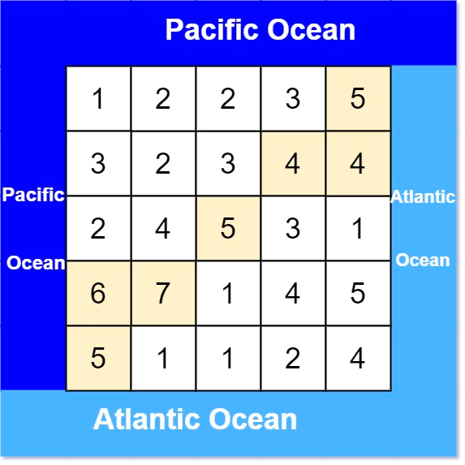

# [Pacific Atlantic Water Flow](https://leetcode.com/problems/pacific-atlantic-water-flow/description/)

There is an `m x n` rectangular island that borders both the **Pacific Ocean** and **Atlantic Ocean**. 
The **Pacific Ocean** touches the island's left and top edges, and the **Atlantic Ocean** touches the island's right and bottom edges.

The island is partitioned into a grid of square cells. 
You are given an `m x n` integer matrix `heights` where `heights[r][c]` represents the **height above sea level** of the cell at coordinate `(r, c)`.

The island receives a lot of rain, and the rain water can flow to neighboring cells directly north, south, east, and west **if the neighboring cell's height is less than or equal to the current** cell's height. 
Water can flow from any cell adjacent to an ocean into the ocean.

Return a **2D list** of grid coordinates `result` where `result[i]` = [r<sub>i</sub>, c<sub>i</sub>] denotes that rain water can flow from cell (r<sub>i</sub>, c<sub>i</sub>) to **both** the Pacific and Atlantic oceans.

#### Example 1:



**Input:** heights = [[1,2,2,3,5],[3,2,3,4,4],[2,4,5,3,1],[6,7,1,4,5],[5,1,1,2,4]]\
**Output:** [[0,4],[1,3],[1,4],[2,2],[3,0],[3,1],[4,0]]\
**Explanation:** The following cells can flow to the Pacific and Atlantic oceans, as shown below:\
[0,4]: [0,4] -> Pacific Ocean\
[0,4] -> Atlantic Ocean\
[1,3]: [1,3] -> [0,3] -> Pacific Ocean\
[1,3] -> [1,4] -> Atlantic Ocean\
[1,4]: [1,4] -> [1,3] -> [0,3] -> Pacific Ocean\
[1,4] -> Atlantic Ocean\
[2,2]: [2,2] -> [1,2] -> [0,2] -> Pacific Ocean\
[2,2] -> [2,3] -> [2,4] -> Atlantic Ocean\
[3,0]: [3,0] -> Pacific Ocean\
[3,0] -> [4,0] -> Atlantic Ocean\
[3,1]: [3,1] -> [3,0] -> Pacific Ocean\
[3,1] -> [4,1] -> Atlantic Ocean\
[4,0]: [4,0] -> Pacific Ocean\
[4,0] -> Atlantic Ocean\
Note that there are other possible paths for these cells to flow to the Pacific and Atlantic oceans.

#### Example 2:

**Input:** heights = [[1]]\
**Output:** [[0,0]]\
**Explanation:** The water can flow from the only cell to the Pacific and Atlantic oceans.


### Constraints:

* m == heights.length
* n == heights[r].length
* 1 <= m, n <= 200
* 0 <= heights[r]\[c] <= 10<sup>5</sup>

# Solutions

```java
class Solution {
    int m,n;

    public List<List<Integer>> pacificAtlantic(int[][] heights) {
        List<List<Integer>> result = new ArrayList<>();
        m = heights.length;
        n = heights[0].length;

        boolean[][] pacific = new boolean[m][n];
        boolean[][] atlantic = new boolean[m][n];

        // mark all the cells reachable from first row using DFS.
        for(int i=0;i<=n-1;i++){
            DFS(heights, 0, i, pacific);
        }
        
        // mark all the cells reachable from first column using DFS.
        for(int i=0;i<=m-1;i++){
            DFS(heights, i, 0, pacific);
        }

        // mark all the cells reachable from last row using DFS.
        for(int i=0;i<=n-1;i++){
            DFS(heights, m-1, i, atlantic);
        }
        
        // mark all the cells reachable from last column using DFS.
        for(int i=0;i<=m-1;i++){
            DFS(heights, i, n-1, atlantic);
        }

        for(int i=0;i<m;i++){
            for(int j=0;j<n;j++){
                if(pacific[i][j]&&atlantic[i][j]){
                    List<Integer> temp = new ArrayList<>();
                    temp.add(i);
                    temp.add(j);
                    result.add(temp);
                }
            }
        }   
        return result;
    }

    private void DFS(int[][] heights, int x, int y, boolean[][] arr){
        //no need for additional visited array because if already visited then arr[x][y] will be set to true.
        if(x<0||y<0||x>=m||y>=n||arr[x][y]) return;

        // since this cell is reachable set to true
        arr[x][y]= true;

        // check upwards;
        if(x-1>=0 && heights[x][y]<=heights[x-1][y]) DFS(heights, x-1, y, arr);

        // check left;
        if(y-1>=0 && heights[x][y]<=heights[x][y-1]) DFS(heights, x, y-1, arr);

        // check down;
        if(x+1<=m-1 && heights[x][y]<=heights[x+1][y]) DFS(heights, x+1, y, arr);
        
        // check right;
        if(y+1<=n-1 && heights[x][y]<=heights[x][y+1]) DFS(heights, x, y+1, arr); 
    }
}
```
